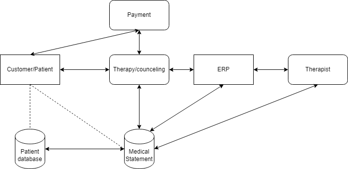

# h1, Should Tero wear a helmet?
## Read / watch / listen and summarize

### Threat modeling
Threat modeling is an analyzing tool used to find out concerns in company security. Threat modeling should be done during designing phase, and it should be an ongoing prodecure during the whole lifecycle of system.
Threat modeling uses four different questions:

1. Braiterman et al 2020: Threat modeling manifesto
   
  1. What are we working on?
     It is important to know what are you doing and with who you are doing it with, different people from different parts of company could have different views on what is important and what should be secure.
  2. What can go wrong?
     Analyzing what really could go wrong
  3. What are we going to do about it?
     What can we do?
  4. Did we do a good enough job?
     Is the problem/bug documented well enough? Do we know what to do in the future if something same kind happens?

  Everyone should do threat modeling. Even inviduals, not only companies.
  You should use Threat modeling manifesto in a way that suits best your needs. Make it your own
  
  Values:
  Use values to find out values that matter.
  Build a curious culture, not checkboxes.
  Use different types of people.
  Collaborate.
  Understand, Dont only fix.
  Do it, dont talk about it. Just do it.
  Keep it continous.
  
  Principles:
  Principles are facts and truths that are used in threat modeling. Use early and througly analysis.
  Systematic approach.
  Theory in practice.
  Informed creativity
  Varied viewpoints

  2. Shostack 2022: Welcome to the Worlds Shortest Threat Modeling Course
     Threat follows data!
     1. Collaborate to find out what are you working on and collaborate on different ways! Not only whiteboard, but talks and brainstorming.
     2. Sketch, it moves your ideas from your head to be visible for others!
     3. Record your work, so you can go back to it. Also, business people might not like only whiteboards and sketches, so its good to document it. Also when you document it, you can find out new things.
     4. Use data flow diagrams (DFD) to find a common language that everyone can follow. External entities, Data flows, Data stores, Trust boundaries and Processes!
     5. Use STRIDE to structure and understand threats. Spoofing, Tampering, Repudiation, Information Disclosure, Denial of service, Elevation of privileges
     6. Recommend threat modeling to a colleague! If they say no, you didnt do good enough of a job.
    
  3. OWASP CheatSheets Series Team 2021: Threat Modeling Cheat Sheet
     1.Threat modeling should be treated as a standard, not a add on.
     2. Good tool to identify risks early on.
     3. There is no "right" for each case, but always room for improvement.
     4. Responses to threats:
        Mitigate: Take actions to minimize happening of threat.
        Eliminate: Remove the feature.
        Transfer: Move the responsibility to the customer.
        Accept: Accept the threat.
      
2. Darknet diaries - DIRTY COMS
I hate podcasts. But this one was quite good. It was an interview with an young hacker who used fake name "Drew" who is talking about how and what hackers use against you, and what kind of database exploits new generation of hackers use.
   1. Hackers hack other hackers. They think you are too a criminal, so they dont feel bad for you. You might think that you are buying a service from a hacker, but you might accidentally show too much of your own information, and they will use it against you.
   2. Never share your screen!
   3. They will blackmail you, sending you stuff or threatening to contact your parents. "Drew" tried to buy service, that his server would rise and get more traffic and more money. But he showed too much and the hacker sent him thousands of boxes.
   4. Hacking and scamming people goes really really deep. But most of the cases are through database leaks, where people find out who are registered to websites, for example netflix. And they use same password and same email in other sites, and people crack password hashes. But most of these high profile sites use 2FA, or mobile authentication, so people will literally go to teleoperators and steal staff ipads and change the victims number to their phone.
   5. Hackers find out exploits. They find out who they should hack because of the exploits, so they can see who has a lot of cryptos.
  
a) Security hygiene. What basic security practices should everyone follow? Are there some security hygiene practicies that every company or average Joe should follow?
   1. Keep your software/systems/apps up to date. Usually the updates are security updates, and not features.
   2. Keep care of your passwords and dont share them to anyone
   3. Companies should do threat modeling and auditate their personel monthly.
   4. Use 2FA!
   5. Dont use same passwords in the same pages. Use really strong passwords and use a password manager

b) Make-belief boogie-man - a threat model for imaginary company.
Imaginary company: Psychotherapy Wellness Again

   1. What are we working on?
      We are working on keeping our patients and clients information secure and safe. We need to keep it safe from hackers, but also safe from our therapists leaking information.
      We should build secure database for the medical statements where only authorized personel can get their hands on.
         Prioritize that patients feel that their information are in secure hands. Crown jewels are customer health information.
       
   Data flow Diagram:
   

   Wellness again is a psychotherapy company that gices therapy and council gor people who have ahd traumatic experiences. We want to build a trust with our customers/patients, and keep their medical info sound and secure.

   2. What can go wrong?
      People could break into our ERP and patient database, and leak patients health information. THis could lead to blackmailing of our customers / therapists, and could even end up in customer suicide.
      Usin STRIDE, this could go to category Information Disclosure. An attacker extracts data from the database and leaks it, causing more trauma.
      COI - Capability, Opportunity, Intent: Hacker could leak information from a patient, and blackmail them for money.
      Business continuity: We should keep patient security number one priority, and customer therapy happiness second. Thats how we get patients to trust us and our system.

   3. What are we going to do about it?
      Mitigate:
      We keep our database secure. We should activate 2FA to all our therapists when using ERP system.
      Only authorized personel can get their hands on medical bills.

   4. Did we do good enough job?
      We should audit our therapist security hygiene much more. Also make a package for the customers how to use our systems.
      
